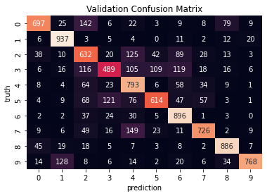

## PyTorch-ResNet-CIFAR10
*Simple ResNet-50 PyTorch project*

*Run train.py to run the model*

*To-Do: Add support for more ResNet variations, drop off, transformations, etc.*

***Work in progress***

The paper on residual learning, which introduced a CNN architecture known as ResNet (https://arxiv.org/pdf/1512.03385.pdf), is a popular classic paper that has led to a large-scale adoption of residual "skip" connections in deep neural networks.

`model.py` provides a PyTorch implementation of this network, with a training loop on the CIFAR-10 dataset provided in `train.py`. This is a work in progress - to get better results I recommend adding random transformations to input data, adding drop out to the network, as well as experimentation with weight initialisation and other hyperparameters of the network. Below, in only ~30 epochs I achieved the below confusion matrix. This network is provided on my Google Drive (https://drive.google.com/file/d/1O61Z4ssJLBTIybv-_KRfV4MkL5tLU2LR/view?usp=sharing) due to GitHub size constraints and can be loaded into an instance of the ResNet50 class provided. The validation performance for this network was `75.22%` when the training was stopped. Class 2 (bird - more classes seen here, https://www.cs.toronto.edu/~kriz/cifar.html) was not predicted by the network, so I helped the network learn this class by saving the model, and running it through a dozen images of birds once. The loss for this class dropped slightly and allowed the class to start to be predicted without overfitting the class. I consequently continued the training as normal, with Class 2 catching up to the performance of other classes over time. These results show example results, with the training interrupted midway due to the amount of time required for the training this netwwork on my computer. Notable on this CM is that classes like 3, 4, 5, 6 (cat, deer, dog, frog), 1 and 9 (automobile and truck), 4 and 7 (deer and horse), and 0, 2, 8 (airplane, bird, ship) tend to be mistaken for each other, which makes sense for obvious reasons and is a sanity check when training the network. 

